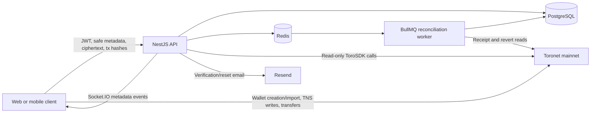

# 📝 ToroChat

## 🌟 Project Overview

ToroChat is a production-grade, non-custodial chat-and-pay application built on the Toronet blockchain. It is designed to coordinate app identity, Toronet wallet identity, encrypted messaging, in-chat payments, transaction recording, reconciliation, audit logs, health checks, and observability without ever becoming a wallet custodian or message custodian.
The app allows users to:

- Register and log into an app account.
- Create/import a Toronet wallet on the client.
- Attach one or more user-controlled Toronet wallets.
- Prove wallet ownership by signing a backend-issued challenge.
- Use TNS usernames for lookup/identity.
- Start one-to-one encrypted conversations.
- Send encrypted messages across registered devices.
- Create in-chat payment intents.
- Authorize NGN, USD, or ToroG transfers client-side through ToroSDK.
- See payment status updates after approval.
- View transaction history

---

## 🔍 Project Details

### 1. Technology Stack

| Area | Technology | Purpose |
|---|---|---|
| Runtime | Node.js 20+ | Backend and worker runtime |
| Language | TypeScript 5 | Strictly typed application code |
| Framework | NestJS 11 | REST API, modules, dependency injection, validation, and WebSockets |
| Database | PostgreSQL 16 | Persistent application, message, and payment data |
| ORM | Prisma 6 | Schema, migrations, and parameterized database access |
| Cache/queue | Redis 7 | Rate limiting and reconciliation jobs |
| Job processing | BullMQ | Transaction reconciliation with bounded retries |
| Blockchain SDK | `torosdk` | Read-only Toronet integration |
| Signature verification | `ethers` 6 | Wallet ownership signature recovery and verification |
| E2EE primitives | `libsodium-wrappers` | Curve25519 device proof-of-possession |
| Password hashing | Argon2id | Application password storage |
| Authentication | JWT and rotated refresh tokens | API authentication and session management |
| Realtime | Socket.IO | Wallet-scoped message and payment notifications |
| Validation | `class-validator`, `class-transformer` | DTO validation and forbidden-field rejection |
| API specification | Swagger/OpenAPI | Runtime API documentation at `/api/docs` |
| HTTP security | Helmet and strict CORS | Browser-facing security controls |
| Notifications | Resend HTTP API | Production verification and password-reset email |
| Testing | Jest, Supertest, Socket.IO client | Unit, integration, HTTP, and realtime E2E tests |
| Infrastructure | Docker, Docker Compose | API, worker, PostgreSQL, and Redis services |
| CI | GitHub Actions | Lint, tests, build, dependency audit, and secret scanning |
| Secret scanning | Gitleaks | Detection of accidentally committed secrets |

### 2. Core Architecture

### 3. Security and Non-Custodial Architecture

ToroChat separates three identity and key domains:

1. **Application identity:** Email, password, and authenticated sessions.
2. **Wallet identity:** A Toronet address attached through signed ownership proof.
3. **Device identity:** A Curve25519 keypair used only for encrypted chat.

### 4. Core Data Model

| Model | Purpose |
|---|---|
| `User` | Application account and lifecycle status |
| `UserProfile` | Display name, avatar, and biography |
| `Session` | Hashed refresh token, expiry, and revocation |
| `EmailVerificationToken` | Single-use hashed verification token |
| `PasswordResetToken` | Single-use hashed reset token |
| `WalletBinding` | Verified wallet ownership and primary/active state |
| `WalletOwnershipChallenge` | Short-lived, single-use signed challenge |
| `TnsUsername` | Display-only live-verified TNS cache |
| `DeviceKey` | Public E2EE device key and revocation state |
| `DeviceRegistrationChallenge` | Encrypted device proof challenge |
| `Conversation` | Unique one-to-one wallet pair |
| `ConversationMember` | Wallet-scoped conversation membership |
| `Message` | Message metadata without plaintext |
| `MessageEnvelope` | Per-device ciphertext and nonce |
| `PaymentIntent` | Sender, derived recipient, amount, and state |
| `TransferRecord` | Unique transaction hash and reconciliation state |
| `PaymentEvent` | Structured payment timeline event |
| `IdempotencyKey` | Financial request replay/conflict protection |
| `AuditLog` | Redacted security and operational events |

### 5. What ToroChat Will Not Provide

#### Wallet Custody and Recovery

- Backend wallet creation or import.
- Wallet-password handling.
- Backend transaction signing.
- Wallet recovery.
- Recovery of wallet credentials through app password reset.
- External wallet connectors.

#### Messaging

- Group chat.
- Public rooms or social feeds.
- Attachments.
- Chat search.
- Read or delivery receipts.
- Server-assisted encrypted-history recovery.

#### Payments and Blockchain Administration

- Smart contract deployment.
- Token minting or burning.
- Administrative currency operations.
- Multi-chain bridges.
- Payment links.
- Backend-controlled transfers.
- Guaranteed transaction confirmation from balance preflight.
- Clickable Toroscan transaction links until the URL format is verified.
- Testnet support.

#### Fiat and Regulated Functionality

- Fiat deposits.
- Bank transfer deposit instructions.
- Virtual bank accounts.
- Fiat deposit verification.
- Fiat withdrawals.
- KYC or BVN collection.
- ConnectW integration.
- KYC badges.
---

## 🧩 Ecosystem Fit

Help us understand how your project contributes to the Toronet ecosystem by answering the following:

- Where and how does your project fit into the Toronet ecosystem?
- Who is your target audience?
- What problem(s) does your project solve?
- Are there existing projects similar to yours within the Toronet ecosystem?
  - If yes, how is your project different?
  - If no, why do you think such a project does not exist yet?

> **Note:** Priority may be given to projects focused on payments, DeFi, consumer applications, infrastructure, developer tooling, AI integrations, real-world utility, and ecosystem adoption.

---

# 👥 Team

- **Contact Name:** Muiliyu Abdul-mujeeb
- **Contact Email:** muiliyuabdulmujeeb@gmail.com
- **Website:** https://www.github.com/muiliyuabdulmujeeb

---

## Team Members

Muiliyu Abdul-mujeeb

### LinkedIn Profiles (if available)

- https://www.linkedin.com/muiliyuabdulmujeeb

---

## Team Code Repositories

- https://github.com/muiliyuabdulmujeeb/torochat
- https://github.com/muiliyuabdulmujeeb/torochat_backend

Please also provide the GitHub accounts of all team members:

- https://github.com/muiliyuabdulmujeeb

# 📊 Development Status

ToroChat backend MVP is substantially implemented through Phases 1–7, including authentication, wallet ownership verification, TNS and balance reads, multi-device encrypted chat, realtime events, payment intents, and transaction reconciliation.
The project is currently in Phase 8 hardening and production-readiness work. Unit tests pass, while the full sequential E2E verification gate and dependency-security review remain unverified. A frontend is not included at the moment.

---

# 📅 Development Roadmap

Break down your roadmap into milestones and deliverables.

Please describe:
- What functionality will be delivered
- How reviewers can verify and test the implementation
- Technical expectations for each milestone

---

## Overview

- **Estimated Duration:** Total project duration
- **Full-Time Equivalent (FTE):** Estimated average number of contributors working on the project

---

> Deliverables 0a to 0d are mandatory. Please adapt them to your project.

The numbered phases below adapt the implementation plan into 19 reviewer-facing deliverables. They describe outcomes rather than individual implementation tasks.

| Number | Deliverable | Specification |
| -----: | ----------- | ------------- |
| 0a. | License | Release ToroChat under the MIT License, as declared in `package.json`. |
| 0b. | Documentation | Provide inline documentation and reviewer guides covering architecture, security boundaries, client integration, ToroSDK behavior, setup, testing, deployment, troubleshooting, and demonstration. |
| 0c. | Testing and Testing Guide | Include unit, integration, security, HTTP E2E, realtime, migration, and reconciliation tests, with reproducible validation instructions in the README and supporting documentation. |
| 0d. | Article / Report | Provide a concise technical report summarizing the architecture, implementation, research, outcomes, limitations, and current project status.|
| 1. | Backend Foundation | Establish a strict TypeScript and NestJS backend with modular boundaries, validated configuration, consistent response envelopes, and centralized error handling. |
| 2. | Database and Persistence | Provide a PostgreSQL data model managed through Prisma migrations, database constraints, indexes, transactions, and a guarded test-database reset workflow. |
| 3. | Infrastructure and Containerization | Supply production-oriented Docker images and Docker Compose services for the API, worker, PostgreSQL, and Redis. |
| 4. | Toronet SDK Gateway | Isolate verified backend-safe ToroSDK reads behind `ToronetGateway` while excluding wallet-secret and password-mediated SDK operations from the backend. |
| 5. | Application Authentication | Implement registration, email verification, email/password login, JWT access tokens, rotated refresh sessions, logout, session revocation, and password reset. |
| 6. | User Profiles and Discovery | Provide private account access, safe public profiles, profile updates, and authenticated discovery through live TNS username resolution. |
| 7. | Wallet Ownership Verification | Bind Toronet wallets through short-lived, single-use server challenges and client-generated signatures verified with `ethers.verifyMessage()`. |
| 8. | Wallet Lifecycle Management | Support multiple verified wallets, one active primary wallet where possible, wallet listing, primary-wallet changes, and safe deactivation rules. |
| 9. | TNS Integration | Provide live TNS name/address lookup and a chain-verified display cache that is never authoritative for financial destinations. |
| 10. | Owner-Only Balances | Return NGN, USD, and ToroG balances only for authenticated users' active wallet bindings while documenting that privacy is enforced only at the application layer. |
| 11. | E2EE Device Identity | Register up to five Curve25519 device public keys through proof-of-possession, with device listing, revocation, and last-device acknowledgement safeguards. |
| 12. | Wallet-Scoped Conversations | Create unique one-to-one conversations between verified app wallet bindings and isolate conversation access by active wallet membership. |
| 13. | Encrypted Message Storage | Store message metadata and one base64 ciphertext envelope per active conversation device while rejecting plaintext and incomplete or unauthorized envelope sets. |
| 14. | Realtime Communication | Provide authenticated Socket.IO subscriptions with wallet-scoped rooms and metadata-only message and payment notifications. |
| 15. | Conversation-Bound Payments | Create idempotent payment intents whose recipients are derived from the other wallet member of a one-to-one conversation, preventing recipient redirection. |
| 16. | Direct Payments | Support direct payment intents to a live-resolved TNS name or validated wallet address without creating fake application identities for on-chain-only recipients. |
| 17. | Transaction Submission and History | Record unique client-submitted transaction hashes, enforce payment state transitions, support pre-submission cancellation, and provide wallet-scoped payment history. |
| 18. | Transaction Reconciliation | Reconcile pending transactions through a Redis/BullMQ worker with bounded retries, guarded updates, conservative receipt/revert parsing, and safe terminal statuses. |
| 19. | Security, Observability, and Bounty Readiness | Complete rate limits, audit events, redacted structured logs, health checks, Swagger, production email delivery, CI checks, security review and documentation. |

---

# 🔮 Future Plans

Please include:

- How you plan to continue development after the bounty or grant
- Plans for additional funding, partnerships, or ecosystem collaboration
- Your long-term vision for the project within the Toronet ecosystem

---

# ℹ️ Additional Information

You may include any additional information relevant to your application, such as:

- Previous hackathon participation or awards
- Existing traction or community
- Prior funding received
- Contributions from external collaborators
- Partnerships or advisors

The Toroforge Collective Bounty Program is intended to support promising builders and projects that can continue growing beyond the initial funding phase.